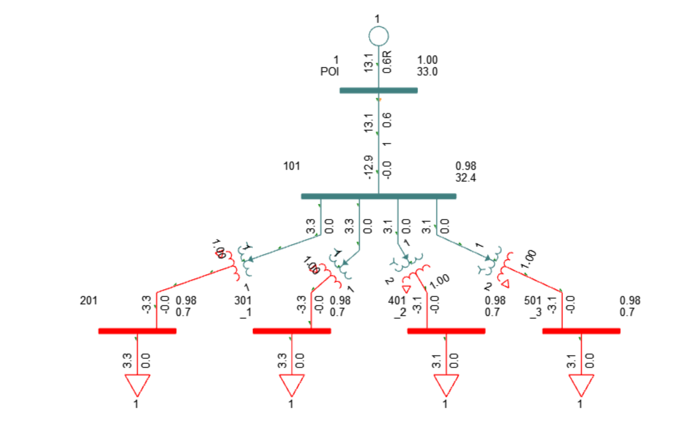

# PSS/E Load Flow Study: 33 kV Network and Inverter Duty Transformer

**Author:** Rabih Al Ahmadieh  
**Study type:** First PSS/E training project - steady-state load flow  
**Status:** Documented simulation screenshot; transformer data verification pending.

## Project objective
Model a 33 kV grid connection, a 10 km transmission line, and a five-winding inverter duty transformer supplying four low-voltage loads. Review the grid supply, voltage profile, and active-power balance.

This portfolio project documents my first PSS/E model, using a Power Projects training assignment. It demonstrates input preparation and interpretation of a load-flow diagram. It is an educational study.

## Network inputs

| Component | Supplied data |
|---|---|
| Grid | 33 kV, 50 Hz, 450 MVA three-phase short-circuit level, X/R = 10 |
| Line | 10 km; R = 0.136 ohm/km; X = 0.404 ohm/km; B = 2.84e-6 S/km |
| Transformer | 13.2 MVA; 33/0.69/0.69/0.69/0.69 kV; 130 kW load loss; 7% impedance |
| Vector group | Y d11 d11 d11 d11, as specified in the Word assignment |
| Loads | Two at 3.300 MW and two at 3.125 MW; total 12.850 MW |

The 10 km line length and vector group are stated in the supplied Word assignment. The workbook records the load quantities. No load power factor or reactive-power demand is explicitly provided in the supplied text; the screenshot shows approximately zero reactive demand at the loads.

## Results visible in the supplied screenshot

| Quantity | Approximate displayed value |
|---|---:|
| Grid active-power supply | 13.1 MW |
| Grid reactive-power supply | 0.6 MVAr |
| Grid bus voltage | 1.00 pu / 33.0 kV |
| Bus 101 voltage | 0.98 pu / 32.4 kV |
| LV bus voltages (201, 301, 401, 501) | 0.98 pu |
| Connected active load from input workbook | 12.850 MW |

The difference between the rounded grid supply and specified load is approximately 0.25 MW. This is an indicative total network loss only: precise losses require unrounded PSS/E output. The screenshot rounds the LV voltage to 0.7 kV and load flows to one decimal place; use the pu values and original inputs for interpretation.

## Input review

- The line R, X and B conversions are consistent with a 100 MVA base at 33 kV.
- The transformer resistance/reactance calculations give R = 0.00984848 pu and X = 0.06930373 pu on the stated 13.2 MVA base.
- **Updated winding allocation:** `Transformer!B7` uses `=B3/4`, giving 3.3 MVA per LV winding. The updated workbook allocates 32.5 kW loss to each branch. It also lists 0.0175 pu impedance at 3.3 MVA while its final R/X calculations use 0.07 pu at 13.2 MVA. Confirm which values and bases are used in the PSS/E equivalent branches.
- Verify the ratings and impedance bases used for each equivalent transformer in PSS/E before treating the results as validated. The diagram depicts four transformer branches; the native case is needed to audit the equivalent model.
- `GRID SOURCE!B8` contains an SCR value of 5 without a stated reference rating or formula. It is not used as a verified project result.

## Files

| Path | Purpose |
|---|---|
| `Calculations/Assignment1_Updated.xlsx` | Updated input and per-unit calculations, preserved unchanged |
| `Images/PSSE_Load_Flow_SLD.png` | Original PSS/E screenshot |
| `Documentation/Engineering_Notes.md` | Calculation checks, assumptions and limitations |
| `Documentation/Swing_Bus_Summary.md` | Screenshot-based summary and missing export fields |
| `Documentation/GitHub_Upload_Guide.md` | Repository setup and upload instructions |
| `Documentation/LinkedIn_Post.txt` | Suggested announcement |
| `Model/README.md` | Native PSS/E case files to add |

## Reproducibility and next steps

1. Resolve transformer winding ratings and impedance-base settings against the course's modeling method.
2. Save and add the native PSS/E `.sav` and `.sld` files; optionally export `.raw`.
3. Add the PSS/E version, system MVA base, transformer equivalent method, load model, tap settings and solver settings.
4. Export the swing-bus summary, convergence/mismatch report, bus voltages and branch losses.
5. Update this README with exact results and remove the pending-verification status only after these checks.

Native SAV and SLD files are now included unchanged. They have not been opened or solved in this workflow. A convergence report remains unavailable. See `Documentation/Transformer_Input_Review.md`: the supplied branch screenshot confirms R/X calculated on 13.2 MVA entered with impedance code 2 and a 100 MVA winding base. Correct this mismatch and confirm the multi-winding equivalent before updating results.

## Attribution and reuse

Assignment specifications originate from the supplied Power Projects course materials. The original course PDF and Word handout are not redistributed in this repository package. The screenshot and workbook were supplied by the author. No open-source license is applied to third-party course material or Siemens software. Confirm permission before publicly redistributing any course-derived workbook content.
